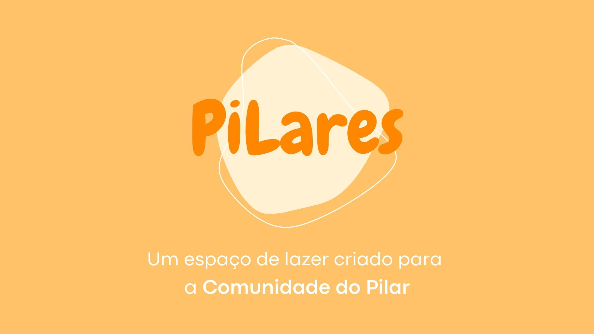

<h1 align="center"> Projeto Pilaris </h1>

Projeto desenvolvido durante o evento Juventudo Code

  <a href="#-tecnologias">Tecnologias</a>&nbsp;&nbsp;&nbsp;|&nbsp;&nbsp;&nbsp;
  <a href="#-projeto">Projeto</a>&nbsp;&nbsp;&nbsp;&nbsp;&nbsp;&nbsp;

 

  

## 🚀 Tecnologias

Esse projeto foi desenvolvido com as seguintes tecnologias:

- HTML e CSS
- JavaScript
- Github

## 💻 Projeto

O Pilaris é um projeto que mostra a idea da criação de um espaço de convivência em uma comunidade carente.
